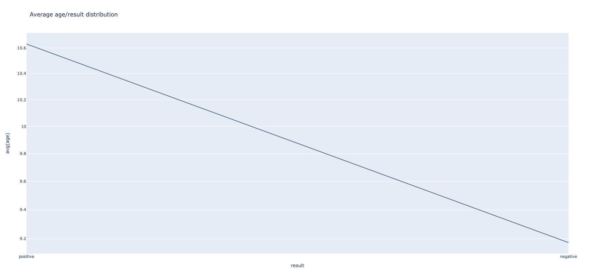

## Struktura analiza, odnosno `job`-ova

Zbog lakšeg izvršavanja i testiranja korak 'Transformacije' izolovan je od 'Ekstrakcije' i 'učitavanja' - ulazni podaci se prihvataju i pakuju u jedinstveni DataFrame. Zatim, kod koji obuhvata transformacije u `main()` funkciji, bavi se izvlačenjem podataka, daljim prosledjivanje funkciji transformacije, kao i čuvanjem rezultata.

Generalizovano, funkcije transformacije bi trebalo dizajnirati kao _idempotent_ funkcije. Drugim rečima, višestruko primenjianje funkcija transformacije ne bi trebalo da rezultuje promenama u izlazu, sve dok nema promena ulaznih podataka. Zbog ovakvog pristupa moguće je izvršavati analize sa ponavlanjima ukoliko je to potrebno (na primer, koristeći `cron` za poziv `spark-submit` komande, po pre-definisanom rasporedu poziva).

## Prosledjivanje konfiguracionih parametara analizama

Kako se ne bi slali argumenti sa komandne linije, efiaksnije rešenje je koristiti konfiguracione fajlove po potrebi - na primer, koristeći `--files configs/jon_name_config.json` flag sa `spark-submit` komandom - flag koji će referencirati konfiguracionu datoteku, datoteka koja se može koristiti u analizama u vidu rečnika, iliti `dictionary` ulaza kao `json.loads(config_file_contents)`.

```python
import json

config = json.loads("""{"field": "value"}""")
```

Datoteka se učitava i parsuje funkcijom `start_spark()` iz pomoćne datoteke `dependencies/spark.py` koja pored parsovanja konfiguracionih fajlova učitava Spark drajver program koji se pokreće na klasteru i alocira loger.

## Pakovanje dependency-a analiza

Deljene funkcije na koje se oslanjaju analize nalaze se u paketu `dependencies` i referenciraju module Spark-a koji su neophodni, na primer:

```python
from dependencies import start_spark
```

Ovaj paket, zajedno sa svim ostalim dependency-ma, mora biti kopiran na svaki Spark čvor. Postoji više načina za postizanje ovoga, izabrano je pakovanje svih zavisnosti u `zip` arhivu zajedno sa poslom koji treba izvršiti, zatim se koristi `--py-files` naredba prilikom pokretanja analize. Pomoćna shell skripta `build_dependencies.sh` koristi se za pakovanje arhive. Ova skripta uzima u obzir graf zavisnosti okruženja i sve navedene zavisnosti u `Pipfile` datoteci.

## Pokretanje posla lokalno/na klasteru

Pokretanje Spark klastera lokalno:

```bash
cd $SPARK_HOME && spark-shell --master local
```

Ukoliko `$SPARK_HOME` promenljiva okruženja ukazuje na instalaciju Spark-a, analiza (posao) pokreće se:

```bash
$SPARK_HOME/bin/spark-submit \
--master local \
--packages 'com.somesparkjar.dependency:1.0.0' \
--py-files packages.zip \
--files configs/etl_config.json \
jobs/job_name.py
```

- `--master local[*]` - adresa Spark klastera. **Ovo može biti lokalni klaster ili klaster u cloud-u koji se zadaje adresom `spark://adresa_klastera:7077`**;
- `--packages 'com.somesparkjar.dependency:1.0.0,...'` - Opcionalno Maven dependency lista koja je potrebna za izvršavanje;
- `--files configs/etl_config.json` - opcionalno putanja do konfiguracione datoteke;
- `--py-files packages.zip` - prethodno pomenuta arhiva sa dependency-ma;
- `jobs/job_name.py` - Python modul sa kodom analize/posla.

Početna točka svake Spark aplikacije je otvaranje sesije. Ovo je driver proces koji održava sve relevantne informacije o aplikaciji u toku njenog životnog ciklusa i odgovoran je za distribuiranje i zakazivanje rada nad svim executor procesima.

```python
def start_spark(app_name='my_spark_app', master='local[*]',
jar_packages=[], files=[], spark_config={}):
    flag_repl = not (hasattr(__main__, '__file__'))

    flag_debug = False

    if not (flag_repl or flag_debug):
        spark_builder = (
            SparkSession
                .builder
                .appName(app_name))
    else:
        spark_builder = (
            SparkSession
                .builder
                .master(master)
                .appName(app_name))
```

Pregled ETL obrade:

```python
def main():
    spark, sql_context, log, config = start_spark(
        app_name='cases_time_analysis',
        files=['configs/cases_time_analysis_config.json'])

    log.warn('Running cases_time analysis...')

    # extracting and transforming the dataset
    data = extract_data(spark)
    data_transformed = transform_data(data, sql_context)

    # confirmed cases and deaths globally
    data_transformed = transform_confirmed_cases(data_transformed)
    load_data(data_transformed, "confirmed_cases_and_deaths_globally")
```

## Pregled dataset-ova i analiza

U nastavku su ukratko opisani korišćeni izvori podataka kao i analize koje su izvršavane.


```diff
- Napomena* sadržaji datasetova se ne nalaze na repozitorijumu i potrebno ih je preuzeti i smestiti u direktorijum /data. Razlog je težina od više desetina GB.

+ Napomena** Nakon svake analize, podaci se prikupljaju u master čvoru i odatle vizualizuju rezultati.
```


## COVID-19 Open Research Dataset Challenge [@Kaggle](https://www.kaggle.com/allen-institute-for-ai/CORD-19-research-challenge/tasks)

Ovaj dataset sadrži više od 400,000 medicinskih članaka o virusu COVID-19, SARS-CoV-2 i relevantnim temama.

#### 1) Izvlačenje abstract zapisa svih članaka

Polazi se od definisanja šeme (shcema) dataseta, a zatim i izvlačenja abstract zapisa svakog članka. Ovde se primenjuje par koraka normalizacije i "pročišćavanja".

```python
def transform_papers_and_abstracts(dataframe):
    df_abstracts = (
        dataframe.select("paper_id", func.posexplode("abstract").alias("pos", "value"))
            .select("paper_id", "pos", "value.text")
            .withColumn("ordered_text", func.collect_list("text").over(Window.partitionBy("paper_id").orderBy("pos")))
            .groupBy("paper_id")
            .agg(func.max("ordered_text").alias("sentences"))
            .select("paper_id", func.array_join("sentences", " ").alias("abstract"))
            .withColumn("words", func.size(func.split("abstract", "\s+")))
    )
    ...
```

#### 2) Sentiment analiza sažetaka

Udf funkcijama paralelizovano se nalaze *sentiment vrednosti* svakog sažetka (abstract). Ove vrednosti se zatim i vizualizuju. Prethodno se sličnom analogijom vrši normalizacija svakog sažetka u vidu transformacije u mala slova i tokenizacije.

```python
def transform_abstracts_words(dataframe):
    udf_function_clean = udf(generate_cleaned_abstracts, StringType())
    udf_function_sentiment = udf(generate_sentiment, DoubleType())
    stopwords = set(STOPWORDS)

    dataframe = dataframe.withColumn("clean_abstract", udf_function_clean("abstract"))
    dataframe = dataframe.withColumn("sentiment_abstract", udf_function_sentiment("clean_abstract"))
    ...
```


#### 3) Nalaženje najčešće korišćenih reči

Oslanjajući se na prethodno dobijeni i normalizovani dataset, gradi se korpus reči i prikazuje 25 najčešće korišćenih.


## COVID-19 Dataset [@Kaggle](https://www.kaggle.com/imdevskp/corona-virus-report)

Ovaj dataset sadrži brojeve registorvanih, oporavljenih i preminulih pacijenata od virusa COVID-19 širom sveta, podeljeno po geografskim oblastima.

#### 1) Sumiranje registrovanih i preminulih pacijenata

Nakon uvodnih transformacija i proširivanja dataseta novim kolonama, kao i preuredjivanjem početnih, vrši se sumiranje gorepomenutih klasa slučajeva. Sumirani vremenski prikaz registrovanih i preminulih pacijenata se prikazuje po logaritamskoj skali.

```python
def transform_papers_and_abstracts(dataframe):
    dt_transformed = dataframe
    dt_transformed = dt_transformed.fillna('', subset=['state'])
    dt_transformed = dt_transformed.fillna(0, subset=['confirmed', 'deaths', 'recovered', 'active'])

    dt_transformed = dt_transformed.withColumn("active", dt_transformed["confirmed"] - dt_transformed["deaths"] - dt_transformed["recovered"])
    dt_transformed = dt_transformed.withColumn("country", func.regexp_replace('country', "Mainland China", "China"))
    
    df_globally = dataframe.groupBy("date").sum("confirmed", "deaths").orderBy("date")
    ...
```


#### 2) Analiza registrovanih slučajeva različitih zemalja

Kao primer, izabrane su zemlje - Srbija, Kina, Italija i Norveška. Filtriranjem i sumiranjem dobijaju se vremenski pregledi napredovanja virusa u ocim zemljama.

```python
def transform_confirmed_cases_countries(dataframe):
    df_serbia = dataframe.filter(dataframe.country == "Serbia")
    df_china = dataframe.filter(dataframe.country == "China")
    df_italy = dataframe.filter(dataframe.country == "Italy")
    df_norway = dataframe.filter(dataframe.country == "Norway")

    df_serbia_grouped = df_serbia.groupBy("date").sum("confirmed").orderBy("date")
    df_china_grouped = df_china.groupBy("date").sum("confirmed").orderBy("date")
    df_italy_grouped = df_italy.groupBy("date").sum("confirmed").orderBy("date")
    df_norway_grouped = df_norway.groupBy("date").sum("confirmed").orderBy("date")
    ...
```


#### 3) Analiza registrovanih slučajeva na nivou Evrope

Particionisanjem datafrema po zemlji, a zatim filtriranju po najsvežijim podacima i na kraju grupacijom koja uzima u obzir samo zemlje Evrope dobija se presek trenutnog stanja registrovanih pacijenata na našem kontinentu.

```python
def transform_confirmed_cases_europe(dataframe):
    df_temp = dataframe.select([c for c in dataframe.columns if c not in {"state"}])
    w = Window.partitionBy("country")
    df_latest = df_temp.withColumn("maxDate", func.max("date").over(w)).where(func.col("date") == func.col("maxDate"))
    df_latest_grouped = df_latest.groupby("country").sum("confirmed")
    df_latest_grouped_europe = df_latest_grouped.filter(df_latest_grouped.country.isin(europe))
    ...
```


Iz istog dataframe-a se lako izvlači opadajuća lista najgore pogodjenih zemalja.


#### 4) Analiza odnosa rasta registrovanih, preminulih i aktivnih slučajeva 

Prethodno obogaćeni dataframe `active` kolonom koja predstavlja razliku ostalih kolona se koristi kao osnova. Sa ovime na umu, veoma lako se vrši sumiranje traženih parametara.

```python
def transform_confirmed_cases_comparison(dataframe):
    df_grouped = dataframe.groupBy("date").sum("recovered", "deaths", "active").orderBy("date")
    ...
```


#### 5) Analiza zemalja po najboljem/najgorem odnosu oporavljenih i preminulih pacijenata

Dodavanjem novih kolona i izvlačenjem informacija o odnosima oporavljenih i preminulih pacijenata u odnosu na ukupan broj, dobija se mera kvaliteta ophodjenja država prema pandemiji. Zatim, na osnovu novododatih kolona, lako se izdvajaju zemlje se najboljim ili najgorim koeficijentima.

```python
def transform_confirmed_cases_comparison_countries(dataframe):
    w = Window.partitionBy('country')
    df_latest = dataframe.withColumn("maxDate", func.max("date").over(w)).where(func.col("date") == func.col("maxDate"))
    df_latest_grouped = df_latest.groupby("country").sum("confirmed", "deaths", "recovered", "active")

    df_latest_grouped_with_mortality_rate = df_latest_grouped.withColumn("mortalityRate", func.round(
        df_latest_grouped["sum(deaths)"] / df_latest_grouped["sum(confirmed)"] * 100, 2)).orderBy("mortalityRate")
        
    df_latest_grouped_with_recovery_rate = df_latest_grouped.withColumn("recoveryRate", func.round(
        df_latest_grouped["sum(recovered)"] / df_latest_grouped["sum(confirmed)"] * 100, 2)).orderBy("recoveryRate")
    ...
```


#### 6) Analiza i predvidjanje budućeg napredovanja pandemije

Analizom serijskih vremenskih podataka mogu se utcrditi trendovi i predvinjanja u sklopu nekog domena. S obzirom da se dataset vremenski orijentisan, mogu se koristiti biblioteke za treniranje modela i predvidjanje budućnosti. Odabrana biblioteka koja je korišćena u ovom slučaju naziva se `prophet`.

```python
    time_series_data = dataframe.select(["date", "confirmed"]).groupby("date").sum().orderBy("date")
    time_series_data = time_series_data.withColumnRenamed("date", "ds")
    time_series_data = time_series_data.withColumnRenamed("sum(confirmed)", "y")
    
    ...
    
    train_range = np.random.rand(len(time_series_data)) < 0.8
    train_ts = time_series_data[train_range]
    test_ts = time_series_data[~train_range]
    test_ts = test_ts.set_index('ds')

    prophet_model = Prophet()
    prophet_model.fit(train_ts)
```

Nakon definisanja podataka za treniranje, dobijaju se gornja i donja granica predikcije, kao i kriva koja predstavlja predvidjeni napredak pandemije.


## Diagnosis of COVID-19 and its clinical spectrum [@Kaggle](https://www.kaggle.com/einsteindata4u/covid19)

Ovaj dataset sadrži anonimne laboratorijske nalaze pacijenata bolnice iz São Paula. Laboratirijski nalazi sa veoma širokog spektra i opisuju izmerene nivoe različitih parametara u krvi. Pored laboratorijskih nalaza prisutne su i informacije o pozitivnom/negativnom rezultatu testiranja pacijenata i slično.

#### 1) Analiza distribucije Hemoglobina i crvenih krvnih zrnaca pacijenata

Nakon uvodnih transformacija i normalizacije dataseta, poput popunjavanja nepoznatih vrednosti, selekcijom i tranformacijom može se doći do distribucije pomenutih parametara medju pacijentima.

```python
def transform_hemoglobin_red_blood_cells_values(dataframe):
    dataframe = dataframe.fillna(0)
    dataframe = dataframe.replace("nan", "0")
    dataframe = dataframe.withColumn("Hemoglobin", dataframe["Hemoglobin"].cast(IntegerType()))
    
    df_hemoglobin = dataframe.select("Hemoglobin")
    df_red_bloof_cells = dataframe.select("Red blood Cells").withColumn("Red blood Cells", func.round(dataframe["Red blood Cells"], 2))
    ...
```


#### 2) Analiza relacije izmedju uzrasta pacijenata i rezultata testa na CVOID-19

Prva transformacija predstavlja odnsos srednje vrednosti starosti pacijenta i verovatnoće pozitivnog testa. Polazi se od grupacije po rezultatu testa a zatim se nalaze agregacije vrednosti uzrasta.

```python
def transform_aggregate(dataframe, sql_context):
    df_age_select = dataframe.select(func.col("SARS-Cov-2 exam result").alias("result"), func.col('Patient age quantile').alias('age'))
    df_age_select.write.mode('overwrite').option("header", "true").save("temporary.parquet",format="parquet")

    df_sql = sql_context.sql("SELECT * FROM parquet.`./temporary.parquet`")
    df_aggregate = df_sql.groupBy("result").agg(func.max("age"), func.avg("age"))
    ...
```

Druga transformacija primenjuje udf funkcije za označavanje pozitvnih/negativnih pacijenata i formira dva podskupa koja sadrže kolone pozitivnosti na COVID i uzrasta.

```python
def transform_age_relations(dataframe, sql_context):
    udf_function_positive = func.udf(is_positive, StringType())
    udf_function_negative = func.udf(is_negative, StringType())

    df_age = dataframe.select(func.col("SARS-Cov-2 exam result").alias("result"), func.col('Patient age quantile').alias('age'))

    df_age_positive = df_age.withColumn("positive", udf_function_positive("result"))
    df_age_negative = df_age.withColumn("negative", udf_function_negative("result"))
    ...
```




#### 2) Analiza pacijenata i brige koja im je pružana

Primenom slične tehnike kao u prošlom primeru, udf funkcijama se označavaju pacijenti koji su pozitivni, a zatim se vrši prikaz onih pacijenata koji su zbrinuti na intenzivnoj nezi.

```python
def transform_care_relations(dataframe, sql_context):
    udf_function_to_numeric = func.udf(negative_positive_to_numeric, IntegerType())

    df_transformed_numeric = dataframe.withColumn("result", udf_function_to_numeric("SARS-Cov-2 exam result"))
    df_transformed_positive = df_transformed_numeric.filter(df_transformed_numeric.result == 1)
    df_transformed_positive_display = df_transformed_positive
    ...
```


#### 3) Predikcije prisutnosti virusa kod pacijenata

Potrebno je pre svega razumeti koje stavke dataseta su nepotpune i eliminisati kolone koje ne bi doprinele izgradnji kvalitetnih modela.

```python
df_transformed_null = dataframe.select(
    [func.count(func.when(func.isnan(c) | func.isnull(c), c)).alias(c) for (c, c_type) in
     dataframe.dtypes])

```


Iz priloženih rezultata može se videti da postoji nekoliko kolona koje su zanemarive.

```python
df_transformed = df_transformed.drop("Mycoplasma pneumoniae", "Urine - Sugar",
                                         "Prothrombin time (PT), Activity", "D-Dimer",
                                         "Fio2 (venous blood gas analysis)", "Urine - Nitrite",
                                         "Vitamin B12")
```

Zatim, možemo prikazati odnose izmedju svih preostalih parametara i pozitivnog/negativnog testa. Takodje, grupacijama možemo prikazati distribuciju rezultata pacijenata.

```python
udf_function_result = func.udf(transform_result, StringType())

df_transformed = dataframe.withColumn("result", udf_function_result("SARS-Cov-2 exam result"))
df_transformed_collected = df_transformed.groupBy('result').count()
```


Na kraju, izgradjuju se različiti modeli nad delom dataseta koji je predodredjen za testiranje. Biraju se kolone koje c2e se koristiti kao ulazne i jedna izlazna (u ovom slučaju rezultat testa).

```python
 # build the dataset to be used as a rf_model base
    outcome_features = ["SARS-Cov-2 exam result"]
    required_features = ['Hemoglobin', 'Hematocrit', 'Platelets', 'Eosinophils', 'Red blood Cells', 'Lymphocytes',
                         'Leukocytes', 'Basophils', 'Monocytes']

    df_transformed_model = df_transformed.select(required_features + outcome_features)

    assembler = VectorAssembler(inputCols=required_features, outputCol='features')
    model_data = assembler.transform(df_transformed_model)
    model_data.show()

    # split the dataset into train/test subgroups
    (training_data, test_data) = model_data.randomSplit([0.8, 0.2], seed=2020)
    print("Training Dataset Count: " + str(training_data.count()))
    print("Test Dataset Count: " + str(test_data.count()))

    # Random Forest classifier
    rf = RandomForestClassifier(labelCol='SARS-Cov-2 exam result', featuresCol='features', maxDepth=5)
    rf_model = rf.fit(training_data)
    rf_predictions = rf_model.transform(test_data)

    # Decision Tree Classifier
    dt = DecisionTreeClassifier(featuresCol='features', labelCol='SARS-Cov-2 exam result', maxDepth=3)
    dt_model = dt.fit(training_data)
    dt_predictions = dt_model.transform(test_data)
    dt_predictions.select(outcome_features + required_features).show(10)

    # Logistic Regression Model
    lr = LogisticRegression(featuresCol='features', labelCol='SARS-Cov-2 exam result', maxIter=10)
    lr_model = lr.fit(training_data)
    lr_predictions = lr_model.transform(test_data)

    # Gradient-boosted Tree classifier Model
    gb = GBTClassifier(labelCol='SARS-Cov-2 exam result', featuresCol='features')
    gb_model = gb.fit(training_data)
    gb_predictions = gb_model.transform(test_data)
```

Uspešnost svih modela se evaluira odvojeno.


