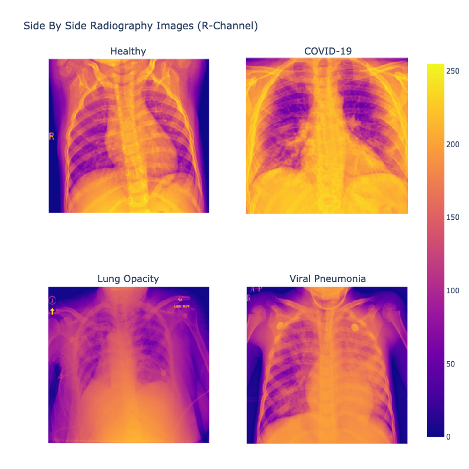
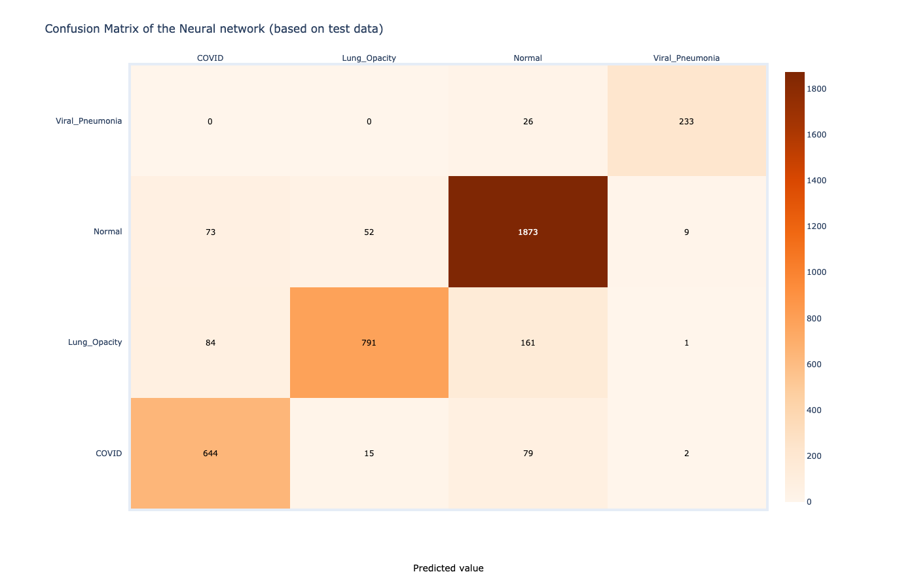
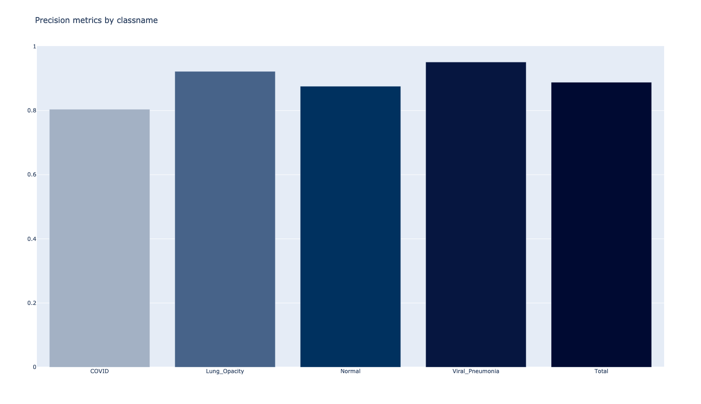
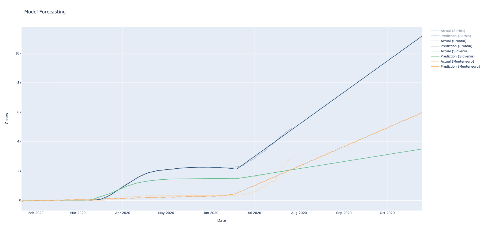
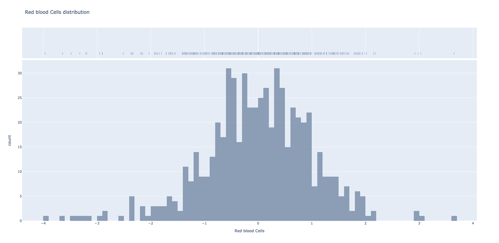

## Struktura analiza

Arhitektura projekta bazirana je na takozvanim Extract-Transform-Load (ETL) poslovima. Zbog lakšeg izvršavanja i testiranja, korak transformacije izolovan je od ekstrakcije i učitavanja. Ulazni podaci prihvataju se i pakuju u jedinstveni DataFrame. Zatim, kod koji obuhvata transformacije bavi se izvlačenjem podataka, daljim prosleđivanjem funkciji transformacije, kao i čuvanjem rezultata.

Generalizovano, funkcije transformacije bi trebalo dizajnirati kao _idempotent_ funkcije. Drugim rečima, višestruko primenjianje funkcija transformacije ne bi trebalo da rezultuje promenama u izlazu, sve dok nema promena ulaznih podataka. Zbog ovakvog pristupa moguće je izvršavati analize sa ponavlanjima ukoliko je to potrebno (na primer, koristeći `cron` za poziv `spark-submit` komande, po pre-definisanom rasporedu poziva).

**Transformacije** predstavljaju pozive transformacionih funkcija *Sparka* gde svaki poziv rezultira formiranjem nove distribuirane strukture. **Učitavanje**, na kraju, svodi se na snimanje konačne strukture u celini.

## Prosledjivanje konfiguracionih parametara analizama

Kako se ne bi slali argumenti sa komandne linije, efiaksnije rešenje je koristiti konfiguracione fajlove po potrebi - na primer, koristeći `--files configs/jon_name_config.json` flag sa `spark-submit` komandom - flag koji će referencirati konfiguracionu datoteku. Ove datoteke mogu se koristiti u analizama u vidu rečnika, iliti `dictionary` ulaza kao `json.loads(config_file_contents)`.

```python
import json

config = json.loads("""{"field": "value"}""")
```

Datoteka se učitava i parsuje funkcijom `start_spark()` iz pomoćne datoteke `dependencies/spark.py` koja pored parsovanja konfiguracionih fajlova učitava Spark drajver program koji se pokreće na klasteru i alocira loger.

## Pakovanje dependency-a analiza

Deljene funkcije na koje se oslanjaju analize nalaze se u paketu `dependencies` i referenciraju module Spark-a koji su neophodni, na primer:

```python
from dependencies import start_spark
```

Ovaj paket, zajedno sa svim ostalim dependency-ma, mora biti kopiran na svaki Spark čvor. Postoji više načina za postizanje ovoga, izabrano je pakovanje svih zavisnosti u `zip` arhivu zajedno sa analizom koju treba izvršiti. Zatim se koristi `--py-files` naredba prilikom pokretanja analize. Pomoćna shell skripta `build_dependencies.sh` koristi se za pakovanje arhive. Ova skripta uzima u obzir graf zavisnosti okruženja i sve navedene zavisnosti u `Pipfile` datoteci.

## Pokretanje posla lokalno/na klasteru

Lokalno pokretanje klastera:

```bash
cd $SPARK_HOME && spark-shell --master local
```

Ukoliko `$SPARK_HOME` promenljiva okruženja ukazuje na instalaciju Spark-a, analiza pokreće se kao:

```bash
$SPARK_HOME/bin/spark-submit \
--master local \
--packages 'com.somesparkjar.dependency:1.0.0' \
--py-files packages.zip \
--files configs/etl_config.json \
jobs/job_name.py
data/data_dir/
```

- `--master local[*]` - adresa Spark klastera. **Ovo može biti lokalni klaster ili klaster u cloud-u koji se zadaje adresom `spark://adresa_klastera:7077`**;
- `--packages 'com.somesparkjar.dependency:1.0.0,...'` - Maven dependency lista;
- `--files configs/etl_config.json` - putanja do konfiguracione datoteke;
- `--py-files packages.zip` - prethodno pomenuta arhiva sa dependency-ma;
- `jobs/job_name.py` - Python modul sa kodom analize.
- `data/data_dir/` - putanja do ulaznog dataseta na HDFS-u.

Početna tačka svake Spark analize je otvaranje sesije. Ovo je driver proces koji održava sve relevantne informacije i odgovoran je za distribuiranje i zakazivanje rada nad svim executor procesima.

```python
def start_spark(app_name='my_spark_app', master='local[*]',
jar_packages=[], files=[], spark_config={}):
    flag_repl = not (hasattr(__main__, '__file__'))

    flag_debug = False

    if not (flag_repl or flag_debug):
        spark_builder = (
            SparkSession
                .builder
                .appName(app_name))
    else:
        spark_builder = (
            SparkSession
                .builder
                .master(master)
                .appName(app_name))
```

Pregled ETL obrade:

```python
def main():
    spark, sql_context, log, config = start_spark(
        app_name='cases_time_analysis',
        files=['configs/cases_time_analysis_config.json'])

    log.warn('Running cases_time analysis...')

    # extracting and transforming the dataset
    data = extract_data(spark)
    data_transformed = transform_data(data, sql_context)

    # confirmed cases and deaths globally
    data_transformed = transform_confirmed_cases(data_transformed)
    load_data(data_transformed, "confirmed_cases_and_deaths_globally")
```

## BDE Klaster

Analize se mogu izvršavati na klasteru računara koji je realizovan *Docker* kontejnerima.

Korišćeni su `bde-spark` imidži - više o njima može se videti [ovde](https://github.com/big-data-europe/docker-spark). Više o postavci kontejnera i klasteru je u direktorijumu `/bde-cluster`. Klaster se može simulirati lokalno gde se pokreće infrastruktura čvorova nad HDFS-om. Tehnički, poziva se `spark-submit` komanda i namenode-u šalju analize za izvršenje. Procedura slanja analize je pritom uopštena docker kontejnerom u kome se izvršava.


## Pregled dataset-ova i analiza

U nastavku su ukratko opisani korišćeni izvori podataka, zatim će biti obradjena većina izvršenih analiza.

Odabrana su četiri različita izvora podataka o ovom virusu:
* COVID-19 Radiography Database [@Kaggle](https://www.kaggle.com/tawsifurrahman/covid19-radiography-database)
* COVID-19 Open Research Dataset Challenge [@Kaggle](https://www.kaggle.com/allen-institute-for-ai/CORD-19-research-challenge)
* COVID-19 Dataset [@Kaggle](https://www.kaggle.com/imdevskp/corona-virus-report)
* Diagnosis of COVIDand its Clinical spectrum [@Kaggle](https://www.kaggle.com/einsteindata4u/covid19)


```diff
- Napomena* sadržaji dataset-ova se ne nalaze na repozitorijumu i potrebno ih je preuzeti i snimiti u direktorijum /data. Razlog je težina od više desetina GB.

+ Napomena** Nakon svake analize, podaci se mogu vizualizovati odvojenim skriptama iz direktorijuma /visualization.
```

## Dash Front-End i vizualizacija rezultata

Kako postoji ukupno četiri grupa ETL analiza, nakon izvršavanja istih, moguće je pristupiti rezultatima i prikazati ih. Za potrebe vizualizacije rezultata odabrano je rešenje `Dash Front-End` koje je bazirano `Flasku`. Pokretanje jedne ovakve web-aplikacije zahteva kao ulazni argumenat putanju do rezultata analiza na HDFS-u.

Na primer, pokretanje servera za vizualizaciju rezultata četvrtog dataseta dobija se uz:

`$ cd visualization && py radiography_analysis_visualization.py hdfs://../path/to/results/`


## COVID-19 Radiography Database [@Kaggle](https://www.kaggle.com/tawsifurrahman/covid19-radiography-database)

Ovaj dataset sadrži rendgenske snimke pacijenata obolelih od virusa SARS-CoV-2, pacijenata koji su pogodjeni "normalnom" pneumonijom, kao i snimke zdravih ljudi. Tim istraživača Univerziteta u Dohi u saradnji sa medicinskim stručnjacima sastavio je ovaj izvor podataka.

#### 1) Pregled uzoraka snimaka i njihove anatomije

Počnimo od učitavanja (Extraction) i formiranja polaznog DataFrame-a. Za potrebe eksrakcije, koristi se već dostupan deo API-a *Sparka* za analizu slika. Kako će se kasnije raditi predikcije, dodaja se kolona `label` koja će se koristiti kao deskriptor klase kojoj primerak slike pripada.

```python
def extract_data(spark):
    ...
    
    dataframe_normal = spark.read.format("image").option("dropInvalid", True) \
        .load(normal_image_dir).withColumn("label", func.lit(DESCRIPTOR_NORMAL))

    dataframe_covid19 = spark.read.format("image").option("dropInvalid", True) \
        .load(covid19_image_dir).withColumn("label", func.lit(DESCRIPTOR_COVID19))

    dataframe_lung_opacity = spark.read.format("image").option("dropInvalid", True) \
        .load(lung_opacity_image_dir).withColumn("label", func.lit(DESCRIPTOR_LUNG_OPACITY))

    dataframe_viral_pneumonia = spark.read.format("image").option("dropInvalid", True) \
        .load(viral_pneumonia_image_dir).withColumn("label", func.lit(DESCRIPTOR_VIRAL_PNEUMONIA))

    return [dataframe_normal, dataframe_covid19, dataframe_lung_opacity, dataframe_viral_pneumonia]
```

Zatim se uzima četiri nasumičnih snimaka (po jedna iz scake kategorije). Polazi se od pregleda snimaka i traži postojanje šablona izmedju slike i grupe kojoj pripada. **Na RGB slici, svaki piksel predstavljen je sa tri 8-bitna broja** koji predstavljaju vrednosti crvene, zelene i plave boje. Ovi brojevi imaju vrednosti u **opsegu od 0 do 255** za svaki kanal boja.


Iako su slike dataseta u crno-beloj boji, sačinjene su od tri kanala, medjutim vrednosti svakog kanala su identične po pikselu. Zatim, na sledećoj slici dat je pregled istih slika sa **izolovanim kanalom crvene boje**.



Iz svega do sada izloženog, može se zaključiti da su rendgenski snimci iz ugla obrade prosti nizovi brojeva oblika `[Height, Width, Channel]`.

#### 2) Analiza zastupnosti klasa rendgenskih snimaka

Sada je dobar trenutak razmotriti zastupnost svih klasa slika u datasetu. Grupisanjem po prethodno pomenutoj opisnoj koloni, a zatim i primenom agregacije, dobija se pregled zastupljenosti.

```python
def transform_percentage_of_samples(dataframe):
    df_percentages = dataframe.groupby('label') \
        .agg((func.count('image')).alias('count'), (func.count('image') / dataframe.count()).alias('percentage')) \
        .orderBy(func.col("label").asc())

    return df_percentages
```


Može se videti da se klasa slika sa najvećim brojem primeraka odnosi na snimke zdravih pacijenata.

#### 3) Analiza distribucije karakteristika boja i osvetljenja

Ova analiza bi trebala da da uvid u moguće šablone koji postoje izmedju boja snimaka i klasa kojima pripadaju. Traže se najmanje, najveće, srednje, kao i vrednosti standardne devijacije *(engl. standard deviation)* boja.

```python

def transform_colour_distribution(dataframe):
    udf_function_min = udf(min_value, FloatType())
    udf_function_max = udf(max_value, FloatType())
    udf_function_mean = udf(mean_value, FloatType())
    udf_function_standard_deviation = udf(standard_deviation_value, FloatType())

    sample_size = 1000

    df_normal = dataframe \
        .filter(dataframe.label == DESCRIPTOR_NORMAL) \
        .limit(sample_size)

    df_covid19 = dataframe \
        .filter(dataframe.label == DESCRIPTOR_COVID19) \
        .limit(sample_size)

    df_lung_opacity = dataframe \
        .filter(dataframe.label == DESCRIPTOR_LUNG_OPACITY) \
        .limit(sample_size)

    df_viral_pneumonia = dataframe \
        .filter(dataframe.label == DESCRIPTOR_VIRAL_PNEUMONIA) \
        .limit(sample_size)

    df_merged = reduce(lambda first, second: first.union(second),
                       [df_normal, df_covid19, df_lung_opacity, df_viral_pneumonia])

    df_colour_distribution = df_merged \
        .withColumn("min", udf_function_min("image.data")) \
        .withColumn("max", udf_function_max("image.data")) \
        .withColumn("mean", udf_function_mean("image.data")) \
        .withColumn("standard_deviation", udf_function_standard_deviation("image.data"))

    return df_colour_distribution
```

Kako je ovo veoma skupa operacija, bira se nasumičnih hiljadu slika iz svake klase. Zatim, primenom udf funkcija nalaze se pomenute vrednosti za svaku od njih. Separacijom po klasama, možemo da utvrdimo i vizualizujemo distribucije pronadjenih vrednosti.

Klasa `Viral Pneumonia` se pokazala kao jedina koja približno oslikava "Normalnu" distribuciju [@Wikipedia](https://en.wikipedia.org/wiki/Normal_distribution).


Najveća moguća vrednost osvetljenja je 255 i sve dostižu vrhove u ovom regionu, što se i očekuje. `Viral Pneumonia`, ponovo, je jedina klasa koja pokazuje niže vrednosti prilikom prikaza distribucije maksimuma. U slučaju maksimuma, `Lung Opacity` i `COVID-19` imaju slične distribucije dok je primetno da snimci zdravih pacijenata imaju svetlije karakteristike.


U slučaju srednjih vrednosti, klase `Lung Opacity` i `Normal` su predstavljene jako sličnom distribucijom. Kako se u svakom ciklusu analize uzima nasumičan podskup uzoraka, može se zaključiti da postoji korelacija s obzirom da je u više navrata dobijen isti rezultat. Medjutim, postoje jasne razlike u vrednostima dostignutih vrhova.


U slučaju standardne devijacije, odnosno mere odstupanja, većina primeraka poseduje vrednosti sličnih granica. Izuzetak predstavlja jedino klasa `Normal` sa primetno većim prosekom. Ova razlika iznosi približno 0.02.


#### 4) Analiza veze srednje vrednosti i standardne devijacije

Na rezultatima x-osa predstavlja srednju vrednost, dok y-osa predstavlja unakrsne vrednosti standardne devijacije posmatranih primeraka. Očigledno, na većini slika su grupacije prisutne u centralnom delu što znači da **nema velikog kontrasta izmedju vrednosti piksela**. Takodje, sve klase poseduju manji broj izolovanih uzoraka na periferiji spektra.

Klase `COVID-19` i `Viral Pneumonia` su jedine koje poseduju manje rasute klastere u donjim-levim uglovima. Ovo su klasteri uzoraka sa malim srednjim vrednostima, kao i malim vrednostima devijacije.

Klasu `Viral Pneumonia` **opisuje centralizovana veza**, što znači da uzorci **imaju više sličnosti medju sobom**, u poredjenju sa ostalim klasama.

Klasu `COVID-19`, sa druge strane, **opisuje suprotna `rasuta` veza**. Odnosno, ima najviše rasutih i izolovanih uzoraka. Ovo može nagovestiti da rendgenski snimci ove grupe imaju više različitosti medju sobom.


#### 5) ML klasifikacija i predikcije

Sparkova `mllib` biblioteka poseduje paletu algoritama mašinskog učenja, jedan od ovih algoritama je *Random forest classifier*. Takozvane šume sastoje se od stabala odluka, kombinuju veliki broj stabala kako bi se smanjio rizik *overfitting-a*. Ovaj algoritam se može koristi za binarnu i multiclass klasifikaciju.

U ovom slučaju, korišćena je multiclass klasifikacija za četiri grupe (prethodno pomenute grupe slika). Izdvajanjem opisnih parametara slika sastavlja se vektor karakteristika. Ovi parametri su `min`, `max`, `mean` i `standard_deviation`. Zatim se dataframe deli u odnosu 0.1/0.9 gde se veći deo koristi za treniranje ML modela. Nakon treniranja se vrši evaluacija modela na preostalim delom ulaza.

```python
def transform_ml_classification(dataframe, spark):
    ...

    df_vectorized = dataframe \
        .withColumn("features_vector", udf_extract_features("image.data")) \
        .withColumn("min", udf_function_min("image.data")) \
        .withColumn("max", udf_function_max("image.data")) \
        .withColumn("mean", udf_function_mean("image.data")) \
        .withColumn("standard_deviation", udf_function_standard_deviation("image.data")) \
        .select(["label", "min", "max", "mean", "standard_deviation"])

    # Assembling features into a vector column
    assembler = VectorAssembler(
        inputCols=["min", "max", "mean", "standard_deviation"],
        outputCol="features"
    )

    df_assembled = assembler \
        .transform(df_vectorized) \
        .select(['features', 'label'])
    df_assembled.cache()

    # Split the dataset into train/test subgroups
    (training_data, test_data) = df_assembled.randomSplit([0.9, 0.1])

    rf = RandomForestClassifier(labelCol='label', featuresCol='features', maxDepth=10)
    rf_model = rf.fit(training_data)
    rf_predictions = rf_model.transform(test_data)

    multi_evaluator = MulticlassClassificationEvaluator(labelCol='label', metricName='accuracy')
    rf_accuracy = multi_evaluator.evaluate(rf_predictions)
```

Evaluacijom je dobijena ukupna uspešnost od ~63%. Ovo je i očekivano s obzirom da je algoritam primenjen na neutemeljenoj metodi. Na sledećoj slici može se videti matrica pogodaka i promašaja modela. Model se pokazao kao najprecizniji za snimke klase `Normal`.


#### 5) DL klasifikacija i predikcije (ne-distribuirano)

"Duboke" neuronske mreže su sofisticiranija metoda klasifikacije, pre svega u slučaju obrade vizualnih datasetova.

Medjutim, podrška distribuiranog treniranja ovih mreža u *pyspark-u* nije na zavidnom nivou. Rešenja koja su dostupna neretko podržavaju samo starije verzije *pyspark-a* ili nisu dovoljno stabilna. Iz ovog razloga, **treniranje neuronske mreže nije distribuirano**.

Odabrana je klasa CNN (Convolutional neural network) neuronskih mreža. Samo "pripremanje" izvora za treniranje mreže obavlja se distribuirano. Nakon oblikovanja ulaznog datafrema, isti se centralizuje u *master* čvoru i počinje sa treniranjem mreže. Na kraju, dobijeni model se snima.

```python
def transform_dl_classification(dataframe, spark):
    udf_function_get_hdfs_origin = udf(hdfs_origin, StringType())
    udf_function_classify = udf(classify, StringType())

    # Preparing the distributed dataframe
    dataframe_keras = dataframe.withColumn("height", dataframe.image.height) \
        .withColumn("width", dataframe.image.width) \
        .withColumn("n_channels", dataframe.image.nChannels) \
        .withColumn("class_name", udf_function_classify("label")) \
        .withColumn("origin", udf_function_get_hdfs_origin("image"))

    dataframe_keras = dataframe_keras.filter(func.col("class_name") != CLASSNAME_INVALID)
    dataframe_keras = dataframe_keras.drop("image", "label")
    dataframe_keras.cache()

    dataframe_keras_master = dataframe_keras.toPandas()

    # Data generators
    # Based on distributed dataframe, batch_size and classes to predict
    [train_datagen, train_gen] = train_generator_from_dataframe(dataframe_keras_master, batch_size, classes)
    [test_datagen, test_gen] = test_generator_from_dataframe(dataframe_keras_master, batch_size, classes)

    # Constructing the deep CNN network
    # Entry kernel layers
    model = Sequential()
    model.add(Conv2D(32, kernel_size=(3, 3), activation='relu', padding='Same', input_shape=(299, 299, 1)))
    model.add(BatchNormalization())

    # Imagery processing layers
    add_imagery_layers(model)

    # Output layers
    model.add(BatchNormalization())
    model.add(Dense(4, activation='softmax'))

    # Compiling the model and initiating training
    model.compile(...)
    model.fit(...)

    [conf_matrix, accuracy] = model_efficacy(model.predict(test_gen), test_gen, classes)

    model.save(...)

    return [
        spark.createDataFrame(conf_matrix),
        spark.createDataFrame(accuracy)
    ]
```

Na sledećim slikama mogu se videti matrica modela, kao i distribucija prediznosti po svim klasama.



Iz matrice "konfuzije" može se videti distribucija promašaja predikcija. Najveći broj promašaja prisutan je u slučajevima klasifikacije snimaka zdravih pacijenata. Nasuprot, najveća preciznost ostvarena je u klasifikaciji primeraka viralne pneumonije.



Može se videti da je nakon treniranja od 128 *epocha* preciznost modela blizu 80%, s tim što je preciznost drastično manja u slučaju primeraka klase `Normal`. Trenirani model nalazi se u direktorijumu `/spark/keras-model` i može se koristiti za distribuirano zaključivanje, koje je objašnjeno u sledećoj analizi.

#### 6) DL klasifikacija (distribuirano zaključivanje)

Kako je model izgradjen na jednom čvoru, a zatim i snimljen, može se iskoristiti distribuirano i eksploatisati pogodnosti sparka.

Metoda distribuiranog zaključivanja *(engl. Model inference)* je **distribuirano izvršavanje modela nad delovima dataframea**, paralelno i na različitim čvorovima. Model se učitava odvojeno na različitim čvorovima i primenjuje - time ostvarujući distribuirano zaključivanje.

```python
def transform_dl_model_inference(dataframe):
    num_sample_images = 100
    udf_function_get_hdfs_image = udf(hdfs_image_data, ArrayType(ByteType()))

    # Take random 100 sample images
    dataframe_pred = dataframe \
        .withColumn("image_data", udf_function_get_hdfs_image("image")) \
        .drop("image", "label") \
        .limit(num_sample_images)

    dataframe_pred.cache()

    # Distributed model inference
    # Predict batches across different partitions in parallel
    dataframe_inference = dataframe_pred \
        .select(predict_batch_udf(func.col("image_data")).alias("prediction"))

    return dataframe_inference


@pandas_udf(ArrayType(FloatType()))
def predict_batch_udf(image_batch_iter):
    batch_size = 64
    model = load_model("./outputs/model/")

    for image_batch in image_batch_iter:
        images = np.vstack(image_batch)
        ds_tensors = tf.data.Dataset.from_tensor_slices(images)
        ds_tensors = ds_tensors.map(parse_image, num_parallel_calls=8) \
            .prefetch(5000).batch(batch_size)

        predictions = model.predict(ds_tensors)

        yield pd.Series(list(predictions))
```

`predict_batch_udf` je metoda koja će se izvršavati na svim čvorovima. Predikcije će se odnositi samo na delove dataframea koji se nalaze na konkretnom čvoru. Nakon paralelnih proračuna, sve predikcije se skupljaju u *master* čvoru.

## COVID-19 Open Research Dataset Challenge [@Kaggle](https://www.kaggle.com/allen-institute-for-ai/CORD-19-research-challenge)

Ovaj dataset sadrži više od 400,000 medicinskih članaka o virusu COVID-19, SARS-CoV-2 i relevantnim temama.

#### 1) Izvlačenje abstract zapisa svih članaka

Polazi se od definisanja šeme (shcema) dataseta, a zatim i izvlačenja abstract zapisa svakog članka. Ovde se primenjuje par koraka normalizacije i "pročišćavanja".

```python
def transform_papers_and_abstracts(dataframe):
    df_abstracts = (
        dataframe.select("paper_id", func.posexplode("abstract").alias("pos", "value"))
            .select("paper_id", "pos", "value.text")
            .withColumn("ordered_text", func.collect_list("text").over(Window.partitionBy("paper_id").orderBy("pos")))
            .groupBy("paper_id")
            .agg(func.max("ordered_text").alias("sentences"))
            .select("paper_id", func.array_join("sentences", " ").alias("abstract"))
            .withColumn("words", func.size(func.split("abstract", "\s+")))
    )
    ...
```

#### 2) Sentiment analiza sažetaka

Udf funkcijama paralelizovano se nalaze *sentiment vrednosti* sažetaka (abstract). Prethodno se sličnom analogijom vrši normalizacija svakog sažetka u vidu transformacije u mala slova i tokenizacije.

```python
def transform_abstracts_words(dataframe):
    udf_function_clean = udf(generate_cleaned_abstracts, StringType())
    udf_function_sentiment = udf(generate_sentiment, DoubleType())
    stopwords = set(STOPWORDS)

    dataframe = dataframe.withColumn("clean_abstract", udf_function_clean("abstract"))
    dataframe = dataframe.withColumn("sentiment_abstract", udf_function_sentiment("clean_abstract"))
    ...
```


#### 3) Nalaženje najčešće korišćenih reči

Oslanjajući se na prethodno dobijeni i normalizovani dataset, gradi se korpus reči i prikazuje 25 najčešće korišćenih.


## COVID-19 Dataset [@Kaggle](https://www.kaggle.com/imdevskp/corona-virus-report)

Ovaj dataset sadrži brojeve registorvanih, oporavljenih i preminulih pacijenata od virusa COVID-19 širom sveta, podeljeno po geografskim oblastima.

#### 1) Sumiranje registrovanih i preminulih pacijenata

Nakon uvodnih transformacija i proširivanja dataseta novim kolonama, kao i preuredjivanjem početnih, vrši se sumiranje gorepomenutih klasa slučajeva. Sumirani vremenski prikaz registrovanih i preminulih pacijenata prikazuje se po logaritamskoj skali.

```python
def transform_papers_and_abstracts(dataframe):
    dt_transformed = dataframe
    dt_transformed = dt_transformed.fillna('', subset=['state'])
    dt_transformed = dt_transformed.fillna(0, subset=['confirmed', 'deaths', 'recovered', 'active'])

    dt_transformed = dt_transformed.withColumn("active", dt_transformed["confirmed"] - dt_transformed["deaths"] - dt_transformed["recovered"])
    dt_transformed = dt_transformed.withColumn("country", func.regexp_replace('country', "Mainland China", "China"))
    
    df_globally = dataframe.groupBy("date").sum("confirmed", "deaths").orderBy("date")
    ...
```


#### 2) Analiza registrovanih slučajeva različitih država

Kao primer, izabrane su države - Srbija, Kina, Italija i Norveška. Filtriranjem i sumiranjem dobijaju se vremenski pregledi napredovanja virusa u njima.

```python
def transform_confirmed_cases_countries(dataframe):
    df_serbia = dataframe.filter(dataframe.country == "Serbia")
    df_china = dataframe.filter(dataframe.country == "China")
    df_italy = dataframe.filter(dataframe.country == "Italy")
    df_norway = dataframe.filter(dataframe.country == "Norway")

    df_serbia_grouped = df_serbia.groupBy("date").sum("confirmed").orderBy("date")
    df_china_grouped = df_china.groupBy("date").sum("confirmed").orderBy("date")
    df_italy_grouped = df_italy.groupBy("date").sum("confirmed").orderBy("date")
    df_norway_grouped = df_norway.groupBy("date").sum("confirmed").orderBy("date")
    ...
```


#### 3) Analiza registrovanih slučajeva na nivou Evrope

Particionisanjem datafrema po zemlji, a zatim i filtiranjem sa grupacijom koja uzima u obzir samo države Evrope, dobija se presek trenutnog stanja registrovanih pacijenata na našem kontinentu.

```python
def transform_confirmed_cases_europe(dataframe):
    df_temp = dataframe.select([c for c in dataframe.columns if c not in {"state"}])
    w = Window.partitionBy("country")
    df_latest = df_temp.withColumn("maxDate", func.max("date").over(w)).where(func.col("date") == func.col("maxDate"))
    df_latest_grouped = df_latest.groupby("country").sum("confirmed")
    df_latest_grouped_europe = df_latest_grouped.filter(df_latest_grouped.country.isin(europe))
    ...
```


Iz istog dataframe-a se lako izvlači opadajuća lista najgore pogodjenih država.


#### 4) Analiza odnosa rasta registrovanih, preminulih i aktivnih slučajeva 

Prethodno obogaćeni dataframe `active` kolonom koja predstavlja razliku ostalih kolona se koristi kao osnova. Sa ovime na umu, veoma lako se vrši sumiranje traženih parametara.

```python
def transform_confirmed_cases_comparison(dataframe):
    df_grouped = dataframe.groupBy("date").sum("recovered", "deaths", "active").orderBy("date")
    ...
```


#### 5) Analiza država po najboljim/najgorim odnosima oporavka i smrtnosti

Dodavanjem novih kolona i izvlačenjem informacija o odnosima oporavljenih i preminulih pacijenata u odnosu na ukupan broj, dobija se mera kvaliteta ophodjenja država prema pandemiji. Zatim, na osnovu novododatih kolona, lako se izdvajaju države se najboljim ili najgorim koeficijentima.

```python
def transform_confirmed_cases_comparison_countries(dataframe):
    w = Window.partitionBy('country')
    df_latest = dataframe.withColumn("maxDate", func.max("date").over(w)).where(func.col("date") == func.col("maxDate"))
    df_latest_grouped = df_latest.groupby("country").sum("confirmed", "deaths", "recovered", "active")

    df_latest_grouped_with_mortality_rate = df_latest_grouped.withColumn("mortalityRate", func.round(
        df_latest_grouped["sum(deaths)"] / df_latest_grouped["sum(confirmed)"] * 100, 2)).orderBy("mortalityRate")
        
    df_latest_grouped_with_recovery_rate = df_latest_grouped.withColumn("recoveryRate", func.round(
        df_latest_grouped["sum(recovered)"] / df_latest_grouped["sum(confirmed)"] * 100, 2)).orderBy("recoveryRate")
    ...
```


#### 6) Analiza i predvidjanje budućeg napredovanja pandemije

Analizom serijskih vremenskih podataka mogu se utvrditi trendovi i predvinjanja u sklopu nekog domena. S obzirom da je dataset vremenski orijentisan, mogu se koristiti biblioteke za treniranje modela i predvidjanje budućnosti. Odabrana biblioteka koja je korišćena u ovom slučaju naziva se `prophet`.

Počevši od filtriranja po državama, dobija se takozvani `timeseries` dataframe koji sadrži dnevne preseke četiri države.

Zatim, izvršenjem operacije `groupBy` po koloni države, iteratori koji sadrže podatke podeljene po državama biće rasporedjeni na različitim čvorovima. Drugim rečima, jedan *worker* čvor će držati barem jednu celokupnu grupu države. Ako se ovo uzme u obzir, treniranje `prophet` modela može se odavde izvršavati distribuirano. Svaki od čvorova će vršiti potrebne proračune za formiranje modela nad svojom pod-grupom podataka (svi će se odnositi na istu državu). `@pandas_udf(result_schema, PandasUDFType.GROUPED_MAP)` metode će biti zadužene za distribuirano treniranje i formiranje predikcija. Na kraju, delovi predikcija biće sumirani u *master* čvoru.

```python
def transform_time_series_forecasting(dataframe, spark):
    df_time_series_data = dataframe.filter(dataframe.country.isin(["Serbia", "Croatia", "Slovenia", "Montenegro"]))
    df_time_series_data = df_time_series_data.select(["date", "confirmed", "country"]) \
        .drop_duplicates() \
        .orderBy("date")

    df_time_series_data = df_time_series_data.withColumnRenamed("date", "ds")
    df_time_series_data = df_time_series_data.withColumnRenamed("confirmed", "y")

    df_forecast = (
        df_time_series_data
            .groupBy('country')
            .apply(distributed_model_prediction)
    )

    return df_forecast

@pandas_udf(result_schema, PandasUDFType.GROUPED_MAP)
def distributed_model_prediction(history_pd):
    history_pd['ds'] = pd.to_datetime(history_pd['ds'])

    # make the model
    prophet_model = Prophet()
    prophet_model.fit(history_pd)

    future_pd = prophet_model.make_future_dataframe(
        periods=90,
        freq='d',
        include_history=True
    )

    # make predictions
    results_pd = prophet_model.predict(future_pd)
    results_pd["country"] = history_pd["country"].iloc[0]

    return pd.DataFrame(results_pd, columns=result_schema.fieldNames())
```

Nakon definisanja podataka za treniranje modela, potrebno je odraditi i samo treniranje koje je distribuirano (po državama). Primenom doobijenih modela dobija se gornja i donja granica predikcije, kao i kriva koja predstavlja predvidjeni napredak pandemije.





## Diagnosis of COVID-19 and its clinical spectrum [@Kaggle](https://www.kaggle.com/einsteindata4u/covid19)

Ovaj dataset sadrži anonimne laboratorijske nalaze pacijenata bolnice iz São Paula. Laboratirijski nalazi su širokog spektra i opisuju izmerene nivoe različitih parametara u krvi. Pored laboratorijskih nalaza prisutne su i informacije o pozitivnom/negativnom rezultatu testiranja pacijenata.

#### 1) Analiza distribucije Hemoglobina i crvenih krvnih zrnaca kod pacijenata

Nakon uvodnih transformacija i normalizacije dataseta, poput popunjavanja nepoznatih vrednosti, selekcijom i tranformacijom može se doći do distribucije pomenutih parametara.

```python
def transform_hemoglobin_red_blood_cells_values(dataframe):
    dataframe = dataframe.fillna(0)
    dataframe = dataframe.replace("nan", "0")
    dataframe = dataframe.withColumn("Hemoglobin", dataframe["Hemoglobin"].cast(IntegerType()))
    
    df_hemoglobin = dataframe.select("Hemoglobin")
    df_red_bloof_cells = dataframe.select("Red blood Cells").withColumn("Red blood Cells", func.round(dataframe["Red blood Cells"], 2))
    ...
```




#### 2) Analiza relacije izmedju uzrasta pacijenata i rezultata testa na virus

Prva transformacija predstavlja odnos srednje vrednosti starosti pacijenta i verovatnoće pozitivnog testa. Polazi se od grupacije po rezultatu testa a zatim se nalaze agregacije vrednosti uzrasta.

```python
def transform_aggregate(dataframe, sql_context):
    df_age_select = dataframe.select(func.col("SARS-Cov-2 exam result").alias("result"), func.col('Patient age quantile').alias('age'))
    df_age_select.write.mode('overwrite').option("header", "true").save("temporary.parquet",format="parquet")

    df_sql = sql_context.sql("SELECT * FROM parquet.`./temporary.parquet`")
    df_aggregate = df_sql.groupBy("result").agg(func.max("age"), func.avg("age"))
    ...
```

Druga transformacija primenjuje udf funkcije za označavanje pozitvnih/negativnih pacijenata i formira dva podskupa koja sadrže kolone pozitivnosti na COVID i uzrasta.

```python
def transform_age_relations(dataframe, sql_context):
    udf_function_positive = func.udf(is_positive, StringType())
    udf_function_negative = func.udf(is_negative, StringType())

    df_age = dataframe.select(func.col("SARS-Cov-2 exam result").alias("result"), func.col('Patient age quantile').alias('age'))

    df_age_positive = df_age.withColumn("positive", udf_function_positive("result"))
    df_age_negative = df_age.withColumn("negative", udf_function_negative("result"))
    ...
```


#### 3) Analiza pacijenata i brige koja im je pružana

Primenom slične tehnike kao u prošlom primeru, udf funkcijama se označavaju pacijenti koji su pozitivni, a zatim se vrši prikaz onih pacijenata koji su zbrinuti na intenzivnoj nezi.

```python
def transform_care_relations(dataframe, sql_context):
    udf_function_to_numeric = func.udf(negative_positive_to_numeric, IntegerType())

    df_transformed_numeric = dataframe.withColumn("result", udf_function_to_numeric("SARS-Cov-2 exam result"))
    df_transformed_positive = df_transformed_numeric.filter(df_transformed_numeric.result == 1)
    df_transformed_positive_display = df_transformed_positive
    ...
```


#### 4) Predikcije prisutnosti virusa kod pacijenata

Potrebno je pre svega razumeti koje stavke dataseta su nepotpune i eliminisati kolone koje ne bi doprinele treniranju efikasnih modela.

```python
df_transformed_null = dataframe.select(
    [func.count(func.when(func.isnan(c) | func.isnull(c), c)).alias(c) for (c, c_type) in
     dataframe.dtypes])

```


Iz priloženih rezultata može se videti da postoji nekoliko kolona koje su zanemarive.

```python
df_transformed = df_transformed.drop("Mycoplasma pneumoniae", "Urine - Sugar",
                                         "Prothrombin time (PT), Activity", "D-Dimer",
                                         "Fio2 (venous blood gas analysis)", "Urine - Nitrite",
                                         "Vitamin B12")
```

Zatim, možemo prikazati odnose izmedju svih preostalih parametara i pozitivnog/negativnog testa. Takodje, grupacijama možemo prikazati distribuciju rezultata pacijenata.

```python
udf_function_result = func.udf(transform_result, StringType())

df_transformed = dataframe.withColumn("result", udf_function_result("SARS-Cov-2 exam result"))
df_transformed_collected = df_transformed.groupBy('result').count()
```


Na kraju, izgradjuju se različiti modeli nad delom dataseta koji je predodredjen za testiranje. Prilikom podele modela, izabran je odnos po kome se 80% ulaznih podataka koristi za treniranje. Biraju se kolone koje će se koristiti kao ulazne i jedna izlazna (u ovom slučaju rezultat testa).

```python
 # build the dataset to be used as a rf_model base
    outcome_features = ["SARS-Cov-2 exam result"]
    required_features = ['Hemoglobin', 'Hematocrit', 'Platelets', 'Eosinophils', 'Red blood Cells', 'Lymphocytes',
                         'Leukocytes', 'Basophils', 'Monocytes']

    df_transformed_model = df_transformed.select(required_features + outcome_features)

    assembler = VectorAssembler(inputCols=required_features, outputCol='features')
    model_data = assembler.transform(df_transformed_model)
    model_data.show()

    # split the dataset into train/test subgroups
    (training_data, test_data) = model_data.randomSplit([0.8, 0.2], seed=2020)
    print("Training Dataset Count: " + str(training_data.count()))
    print("Test Dataset Count: " + str(test_data.count()))

    # Random Forest classifier
    rf = RandomForestClassifier(labelCol='SARS-Cov-2 exam result', featuresCol='features', maxDepth=5)
    rf_model = rf.fit(training_data)
    rf_predictions = rf_model.transform(test_data)

    # Decision Tree Classifier
    dt = DecisionTreeClassifier(featuresCol='features', labelCol='SARS-Cov-2 exam result', maxDepth=3)
    dt_model = dt.fit(training_data)
    dt_predictions = dt_model.transform(test_data)
    dt_predictions.select(outcome_features + required_features).show(10)

    # Logistic Regression Model
    lr = LogisticRegression(featuresCol='features', labelCol='SARS-Cov-2 exam result', maxIter=10)
    lr_model = lr.fit(training_data)
    lr_predictions = lr_model.transform(test_data)

    # Gradient-boosted Tree classifier Model
    gb = GBTClassifier(labelCol='SARS-Cov-2 exam result', featuresCol='features')
    gb_model = gb.fit(training_data)
    gb_predictions = gb_model.transform(test_data)
```

Uspešnost svih modela evaluira se odvojeno, nad preostalim delom dataseta koji je označen za ovu svrhu.


